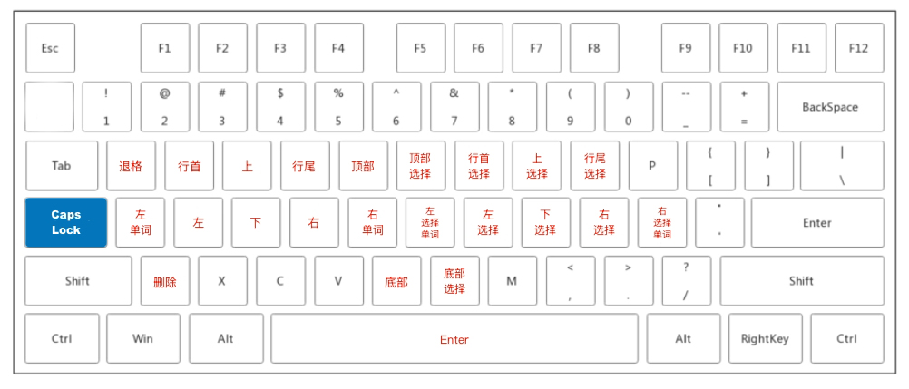

# CAPSLOCK YES（Auto Hotkey）

> macOS 版本请查看 [CAPSLOCK YES](https://github.com/lianginx/capslock-yes)

通过 [Auto Hotkey](https://www.autohotkey.com/) 将按下 `CapsLock` 映射为快捷键，搭配字母键组合出一套全新的快捷键；

让你的双手在编辑代码时，不再需要离开字母区就能随心所欲地快速移动光标或选中文字；

右手使用鼠标时，也不再需要放开鼠标就能精准移动光标到想要的位置；

|      热键      |   映射键位    |        热键        |       映射键位        |
| :------------: | :-----------: | :----------------: | :-------------------: |
|   `CapsLock`   |     `Esc`     | `CapsLock` `Space` |        `Enter`        |
| `CapsLock` `E` |      `↑`      |   `CapsLock` `I`   |      `Shift` `↑`      |
| `CapsLock` `D` |      `↓`      |   `CapsLock` `K`   |      `Shift` `↓`      |
| `CapsLock` `S` |      `←`      |   `CapsLock` `J`   |      `Shift` `←`      |
| `CapsLock` `F` |      `→`      |   `CapsLock` `L`   |      `Shift` `→`      |
| `CapsLock` `W` |    `Home`     |   `CapsLock` `U`   |    `Shift` `Home`     |
| `CapsLock` `R` |     `End`     |   `CapsLock` `O`   |     `Shift` `End`     |
| `CapsLock` `T` | `Ctrl` `Home` |   `CapsLock` `Y`   | `Ctrl` `Shift` `Home` |
| `CapsLock` `B` | `Ctrl` `End`  |   `CapsLock` `N`   | `Ctrl` `Shift` `Home` |

## 使用

下载 [Auto Hotkey](https://www.autohotkey.com/) 并安装，下载 [配置文件](capslock-yes.ahk) 并打开即可使用。

## 开机自启

按下 `Win` `R` 打开运行窗口，输入 `shell:startup` 点击确认后弹出启动文件夹，最后将下载的配置文件拖入该目录即可。
